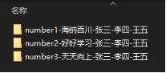
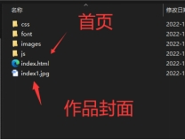
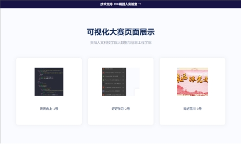

# 可视化大赛页面展示项目（丐版）

本可视化展示页面是基于Django框架运行的，因为功能少，需求是需要将参赛队伍提交的【H5】作品上传至服务器展示即可，故开发周期仅一天。可供新生学习参考，并无任何商业价值。

# 一、项目架构

## 1.1软件环境

|  Software   | Version |
| :---------: | :-----: |
|   Python3   | 3.9.12  |
|   PyMySQL   |  1.0.2  |
| mysqlclient |  2.1.1  |
|   Django    |  4.1.3  |
|             |         |

## 1.2硬件环境

腾讯云轻量应用服务器 1G1核

# 二、作品提交规范

## 2.1命名规范

参赛作品需严格按照命名规范提交，才能成功将项目部署至服务器，命名格式number1-团队名称-队员1-队员2-队员3，如图1所示。

 

图1 命名格式示意图

## 2.2作品规范

所有提交的参赛作品的首页命名需为：index.html，否则将无法打开。请各位同学注意各个页面之间的链接路径，避免出现网页无法打开的情况。

同时，需要在作品文件夹里面放入一张像素大小为500px*500px，格式为jpg的图像用做展示封面(也可以是比例1:1的图像)，命名格式为:index+作品编号，封面图片与作品的编号一致规范如图2所示。

 

图2 作品文件目录示意图

可视化大赛页面展示效果如图3所示:

 

图3 作品提交展示示例图

 